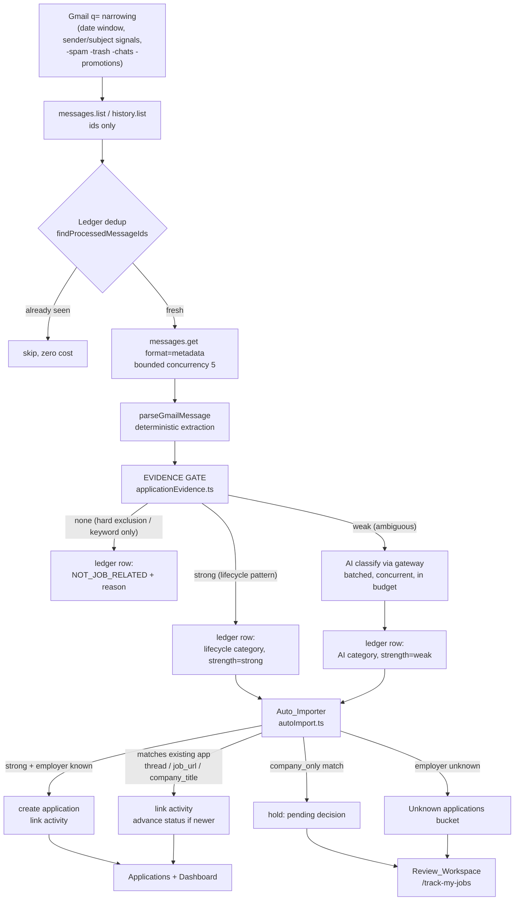

# Design Document

## Overview

Gmail tracking currently escalates a message to candidate status on either of two signals: the sender is an ATS/job-board domain (`isAtsDomain`), or the subject/snippet contains one of seven words (`/\b(application|applied|candidate|candidacy|position|role|hiring|recruit)/i`). Both signals are present in almost every job-board notification, so ~637 of ~750 scanned messages reached the review queue and the AI classifier. Job alerts, LinkedIn feed notifications, course promotions, and loan mail are indistinguishable from real application correspondence under that rule.

This design replaces those two signals with a single deterministic **Evidence Gate** that asks a different question: *does this message evidence a stage of an application this user actually made?* Everything else follows from that answer:

- Messages with no lifecycle evidence are rejected before any AI spend, and are ledgered so they are never re-examined.
- Messages with **strong** deterministic lifecycle evidence are classified for free and organized automatically.
- Only the narrow band where deterministic rules genuinely cannot decide reaches the model, and a model verdict alone can never create an application.

Four supporting changes ride along: automatic organization (Auto_Importer) so the user is not asked to approve hundreds of obvious applications, an Unknown-applications bucket so lifecycle mail with no resolvable employer neither pollutes nor disappears, a 30-day default scan window with a selectable set, and real dashboard/integration data replacing the mocked weekly chart and the missing Gmail address.

### What this design does not change

The Sprint 8 baseline is load-bearing and is treated as frozen. None of the following may be altered by the implementation:

| Protected behaviour | Where it lives | Why it must not move |
| --- | --- | --- |
| Incremental sync via `historyId` / `history.list` | `sync.ts`, `client.ts`, `gmail.ts` | The only reason a second scan is cheap |
| List page size decoupled from processing batch size | `GMAIL_LIST_PAGE_SIZE=200`, `BATCH_MESSAGE_LIMIT=60` | ~20x reduction in request cycles |
| Bounded-concurrency metadata fetch | `mapWithConcurrency`, `METADATA_FETCH_CONCURRENCY=5` | Keeps a batch inside its time budget without breaching Gmail quota |
| Bounded concurrent AI classification inside the time budget | `AI_CONCURRENCY=3`, `AI_BATCH_SIZE=10` | Prevents 47s batches |
| Resumable, deduplicated sync | `gmail_activity` `UNIQUE(user_id, gmail_message_id)`, `page_token` cursor held back until a page is fully processed | Idempotency guarantee |
| Full-sync fallback on expired history | `GmailHistoryExpiredError` → `clearGmailHistoryAnchor` | Documented Gmail recovery path |
| Deterministic monotonic status inference | `statusInference.ts` | A late-processed old email can never downgrade a status |
| Company / role / portal separation | `companyFromDomain`, `portalNameFromDomain`, `sanitizeCompanyName` | A portal is never an employer |
| OAuth, token storage, RLS, AI gateway, applications schema | `oauth.ts`, `tokens.ts`, migrations, `ai/gateway.ts` | Security surface; out of scope |
| `applications.status` CHECK constraint | `supabase-schema.sql` | Five values only: Applied, Interview, Offer, Rejected, Ghosted |

The verification baseline (TypeScript clean, 258 tests passing, build successful) is the acceptance bar for every task derived from this design.

### Core product decision

The scanner is **not** a keyword-based importer. Precision is ranked above recall: fabricating an application the user never made destroys trust in the tracker, while missing one is recoverable by a wider scan or a manual add. Every rule below is written so that the failure mode is "not tracked", never "invented".

An ATS or job-board sender domain is, by itself, **never** evidence. It is a routing fact about who relayed the mail.

---

## Architecture

### Pipeline



The cost funnel is unchanged in shape; the Evidence Gate replaces the heuristic escalation stage and is the first place volume collapses. Everything to the left of the gate is Sprint 8 code that keeps working as-is.

### Module map

New modules (all pure unless noted):

| Module | Responsibility | Purity |
| --- | --- | --- |
| `src/lib/gmail/applicationEvidence.ts` | The Evidence Gate. One `ParsedEmail` → `EvidenceVerdict`. | Pure |
| `src/lib/gmail/autoImport.ts` | Decide + apply automatic organization. `decideProposal` is pure; `runAutoImport` performs user-scoped writes. | Split |
| `src/lib/gmail/reconcile.ts` | Deterministic repair of already-imported applications. `planReconciliation` pure; `runReconciliation` writes. | Split |
| `src/app/dashboard/metrics.ts` | Real weekly buckets, status distribution, portal distribution, range filtering. | Pure |

Modified modules:

| Module | Change | Risk |
| --- | --- | --- |
| `heuristics.ts` | `evaluateEmail` becomes a thin adapter over the Evidence Gate. Keyword and bare-ATS escalation deleted. All other exports unchanged. | Medium — two existing tests need edits (see Existing Test Conflicts) |
| `query.ts` | Default window 180d → 30d; add `60d`; add the user-selectable window set; add `-category:promotions`. `HISTORY_RANGES` keeps `6m`/`1y` for backward compatibility. | Low |
| `statusInference.ts` | Assessment invitations resolve to `Interview` (no new status, no new category). | Low |
| `proposals.ts` | Carry `evidenceStrength` through; expose `hasStrongEvidence` and `isLifecycleEvent` per proposal. Grouping unchanged. | Low |
| `sync.ts` | Persist `evidence_strength` / `evidence_reason`; re-gate AI output; invoke Auto_Importer after persistence, inside the time budget. | Medium |
| `api/gmailActivity.ts` | New fields on the record/row types; `fetchUnknownBucket`, `fetchLifecycleActivityForAutoImport`, `getCompletedFullScanWindowStart`. | Low |
| `api/gmail.ts` | Store and read `gmail_address`. | Low |
| `api/gmail/sync/route.ts` | Validate the new window set; choose sync mode with window coverage; return created/updated counts. | Medium |
| `api/gmail/callback/route.ts` | One `getProfile` call to capture the mailbox address. | Low |
| `app/page.tsx`, `dashboard/*`, `track-my-jobs/*`, `settings/integrations/*` | Real metrics, results-first review UI, connection detail. | Low |

### Data flow, one scan

1. Client posts `{ window: "30d" }` to `/api/gmail/sync`.
2. Route validates the window against the selectable set, resolves tokens, decides `full` vs `incremental` (see Scan-Window Behaviour), opens or reuses the single open job.
3. `runSyncBatch` lists ids, dedups against the ledger, fetches metadata concurrently, runs the Evidence Gate per message, batches only `weak` messages to the AI gateway, writes ledger rows, then advances the cursor.
4. `runAutoImport` runs on the same request, after persistence, bounded by the remaining time budget and a proposal cap.
5. Route returns progress plus `created` / `updated` for this batch; the client loops until `done`.
6. On `done`: promote the history anchor, touch `last_sync_at`, run a final unbounded-by-cap `runAutoImport`, then `router.refresh()` so the workspace shows results, not a queue.

---

## Components and Interfaces

### 1. Evidence Gate — `src/lib/gmail/applicationEvidence.ts`

The single authority on whether a message evidences this user's application lifecycle. Pure: no network, no AI, no database, no clock dependency beyond what it is given.

```ts
export type EvidenceStrength = "strong" | "weak" | "none";

export type EvidenceReason =
  // --- negative tier (hard exclusions) ---
  | "excluded_gmail_label"
  | "excluded_job_alert"
  | "excluded_social_notification"
  | "excluded_financial_application"
  | "excluded_marketing"
  | "excluded_hiring_announcement"
  // --- strong tier ---
  | "lifecycle_subject_match"
  | "lifecycle_body_match"
  // --- medium tier (resolves to weak) ---
  | "ats_sender_with_candidate_language"
  | "application_url_with_candidate_language"
  | "application_url_only"
  // --- weak/none tier ---
  | "keyword_only"
  | "no_application_evidence";

export interface EvidenceVerdict {
  strength: EvidenceStrength;
  /** A Lifecycle_Category when strength is "strong"; null otherwise. */
  category: EmailCategory | null;
  /** True only for strong lifecycle evidence. */
  isLifecycleEvent: boolean;
  /** 0.95 subject match, 0.8 body match, 0.9 hard exclusion, 0.6 no signal, 0 weak. */
  confidence: number;
  /** Non-content reason code. Safe to log and safe to show the user. */
  reason: EvidenceReason;
}

export const LIFECYCLE_CATEGORIES: ReadonlySet<EmailCategory>;
export function isLifecycleCategory(category: EmailCategory | null): boolean;
export function evaluateApplicationEvidence(email: ParsedEmail): EvidenceVerdict;
```

#### Evidence hierarchy

The requirements expose three strengths (`strong` | `weak` | `none`). Internally the gate reasons over four signal tiers and collapses them onto those three. The collapse is the whole point: a medium signal is worth a model call, a lone weak signal is worth nothing.

| Tier | Signals | Resolves to |
| --- | --- | --- |
| **Negative** | Gmail `CATEGORY_PROMOTIONS` / `SPAM` / `TRASH`; job alert, digest, recommendation, saved-search, "similar jobs"; social-network notification (connection, profile view, post activity, "people you may know", "application was viewed"); financial application (loan, credit card, insurance, EMI, KYC, mortgage); newsletter, promotion, course, certification, webinar, salary report; "posted a job" / "is hiring" announcement | `none` |
| **Strong** | Explicit application acknowledgement or receipt; "your application was sent to X"; application/candidate reference id paired with a status statement; interview or screening invitation; assessment invitation tied to an application; rejection of the user's application; offer of employment; application-status update; interview reschedule/reminder; withdrawal | `strong` |
| **Medium** (needs a partner signal) | ATS/portal sender domain; deterministically extracted ATS application/job URL; recruiter correspondence; requisition or job id; candidate-facing possessive language ("your application", "your candidacy", "your submission", "you applied", "your resume/CV", "application id/reference", "candidate id/portal") | `weak` (AI adjudicates) only when **two** medium signals co-occur, or an application URL is present |
| **Weak** | A bare occurrence of "application", "applied", "candidate", "candidacy", "position", "role", "hiring", "recruit"; a generic company/product mention; an unsubscribe header | `none` — never escalates on its own |

#### Evaluation order

Order is normative, not incidental. Hard exclusions run **before** strong patterns so that "Loan application received" and "Your application was viewed by 3 recruiters" cannot be laundered into lifecycle evidence by a phrase match.

1. **Label exclusion.** `CATEGORY_PROMOTIONS`, `SPAM`, `TRASH` → `none` / `excluded_gmail_label`.
2. **Hard-exclusion patterns.** Evaluated against subject + snippet only, never against full body footers — legitimate ATS mail routinely carries "unsubscribe" and marketing boilerplate below the signature, and matching there would reject real interview invitations. The first matching class names the reason.
3. **Strong lifecycle detection.** Ordered furthest-along-first so a single email matching several patterns yields the most advanced stage: `OFFER` → `REJECTION` → `INTERVIEW_INVITATION` → `INTERVIEW_UPDATE` → `APPLICATION_CONFIRMATION` / `APPLICATION_RECEIVED` → `APPLICATION_UPDATE` → `WITHDRAWAL`. Subject hit → confidence 0.95; body hit → 0.8.
4. **Medium combination.** (ATS/portal sender **or** application URL) **and** candidate-facing language → `weak`.
5. **Application URL alone** → `weak`. Deliberate, narrow exception: `findJobUrl` only matches known ATS URL shapes, and by this point every alert/digest/promotional shape has already been excluded. It can never create an application on its own, because auto-import requires a strong evidence row.
6. **Otherwise** → `none`, with `keyword_only` when a bare listed keyword was the sole match, else `no_application_evidence`.

#### Exclusion classes must not eat real mail

Two specific hazards, both handled by pattern rather than by domain:

- **LinkedIn / Naukri relay genuine lifecycle mail.** "Your application was sent to Acme" is a real application confirmation delivered by `linkedin.com`. Social exclusion is therefore pattern-based (connection requests, profile views, post activity, "people you may know", "your application was viewed"), never sender-based. A new confirmation pattern `/your application was sent to/i` is added explicitly.
- **Employers announce openings to their own mailing lists.** "We're hiring a Backend Engineer" is an announcement, not evidence, and is excluded even from an employer domain.

### 2. Heuristic adapter — `heuristics.ts`

`evaluateEmail` keeps its exact signature and `HeuristicVerdict` shape, and keeps every legacy `reason` string, so downstream code and existing tests are unaffected. It becomes a pure mapping (Requirement 3.3–3.6):

| Gate result | `candidate` | `category` | `needsAI` | `confidence` | `reason` |
| --- | --- | --- | --- | --- | --- |
| `none`, exclusion reason | false | `NOT_JOB_RELATED` | false | 0.9 | `bulk_or_marketing` |
| `none`, `keyword_only` / `no_application_evidence` | false | `NOT_JOB_RELATED` | false | 0.6 | `no_job_signal` |
| `strong` | true | gate category | false | gate confidence | `pattern_match` |
| `weak`, `ats_sender_with_candidate_language` | true | null | true | 0 | `ats_sender_ambiguous` |
| `weak`, application-URL reasons | true | null | true | 0 | `job_url` |

Deleted from `heuristics.ts`: the `weakSignal` keyword regex and the bare `fromAts` escalation. `looksLikeBulkMail`, `detectCategory`, `isAtsDomain`, `companyFromDomain`, `portalNameFromDomain`, `isPortalDisplayName`, `sanitizeCompanyName`, `PORTAL_DISPLAY_NAME_SET`, `EMAIL_CATEGORIES` all stay exported with unchanged behaviour. `looksLikeBulkMail` and `detectCategory` are re-implemented as delegations to the gate's exclusion and lifecycle stages so there is exactly one copy of each pattern set.

### 3. Scan window — `query.ts`

```ts
export const DEFAULT_SCAN_WINDOW: ScanWindow = "30d";
export const DEFAULT_WINDOW_DAYS = 30;

/** The user-selectable set. Validated at the API boundary. */
export const SCAN_WINDOWS = ["7d", "30d", "60d", "90d", "all"] as const;
export type ScanWindow = (typeof SCAN_WINDOWS)[number];
export function isScanWindow(value: unknown): value is ScanWindow;

/** Superset kept for backward compatibility: 6m and 1y remain resolvable. */
export const HISTORY_RANGES = { "7d": 7, "30d": 30, "60d": 60, "90d": 90, "6m": 180, "1y": 365, all: null };
export function resolveWindow(range: HistoryRange = DEFAULT_SCAN_WINDOW, now?: Date): WindowBounds;
export function buildGmailQuery(options: { range?: HistoryRange; now?: Date; extraSubjectSignals?: string[] }): string;
```

Decisions:

- **30 days is the default and the recommendation.** It covers an active search, keeps the first scan to a few hundred messages, and keeps AI spend near zero. `90d` is offered as an explicit broader historical scan; `all` is offered but never defaulted.
- **`6m` and `1y` stay in `HISTORY_RANGES`.** They are no longer offered in the UI and are not in `SCAN_WINDOWS`, but `resolveWindow("6m")` still returns 180 days. This preserves the existing test assertion verbatim (see Existing Test Conflicts) and costs nothing.
- **Invalid input falls back to `30d`**, at the route boundary, before a job is created (Requirement 9.6).
- **`-category:promotions` is added to the query.** Requirement 1.8 already forces promotional mail to `none`, so excluding it server-side saves the `messages.get` entirely. Documented as a one-line reversal if a provider is found to route transactional ATS mail into Promotions.
- `-in:spam`, `-in:trash`, `-in:chats` and the sender/subject signal group are unchanged.

### 4. Sync pipeline — `sync.ts`

Changes are confined to the classification and persistence steps. Listing, dedup, concurrency, budget, and cursor logic are untouched.

- Step 4 calls `evaluateEmail` (now gate-backed) and writes `evidenceStrength` / `evidenceReason` onto every ledger row, including rejections. Rejections continue to be ledgered (Requirement 4.1) — that is what makes a re-scan free.
- Step 5 re-gates AI output before it is stored: the model's category is accepted only from the classification vocabulary; a lifecycle category from the model is stored with `evidence_strength = "weak"`; company still passes `sanitizeCompanyName`; the deterministic `jobUrl` still wins over the model's. A model verdict therefore never satisfies the auto-create precondition on its own.
- Step 6 unchanged, then Auto_Importer:

```ts
const remainingMs = BATCH_TIME_BUDGET_MS - (Date.now() - startedAt);
if (remainingMs > AUTO_IMPORT_MIN_BUDGET_MS) {
  autoImport = await runAutoImport(supabase, userId, {
    connectionId: job.connectionId,
    maxProposals: AUTO_IMPORT_BATCH_CAP, // 50
  }).catch(() => null); // never fails the scan
}
```

`BatchResult` gains `applicationsCreated`, `applicationsUpdated`, and `evidenceReasonCounts` (a `Record<EvidenceReason, number>` for observability). No email body is written anywhere.

### 5. Auto_Importer — `src/lib/gmail/autoImport.ts`

The decision function is pure and independently testable; the runner is the only part that touches Supabase.

```ts
export type AutoImportAction = "create" | "link" | "hold_ambiguous" | "hold_unknown_employer";

export interface AutoImportDecision {
  action: AutoImportAction;
  applicationId: string | null;  // set for "link"
  reason: string;                // non-content code, surfaced in the UI
}

export function decideProposal(proposal: ApplicationProposal): AutoImportDecision;

export interface AutoImportResult {
  created: number;
  updated: number;
  linked: number;
  heldAmbiguous: number;
  heldUnknownEmployer: number;
  failed: number;
}

export async function runAutoImport(
  supabase: SupabaseClient,
  userId: string,
  options?: { maxProposals?: number; now?: number; connectionId?: string | null }
): Promise<AutoImportResult>;
```

#### Decision paths

Evaluated in order; the first match wins.

| # | Condition | Action | Requirement |
| --- | --- | --- | --- |
| 1 | `matchTier` is `thread`, `job_url`, or `company_title` | **link** to that application, then resolve and conditionally advance status | 5.3, 6.1–6.4 |
| 2 | `matchTier` is `company_only` | **hold_ambiguous** — an unrelated role at the same employer must never be merged silently | 5.4 |
| 3 | `company !== null` **and** `hasStrongEvidence` **and** `isLifecycleEvent` | **create** the application, link its activity | 5.2 |
| 4 | `company === null` | **hold_unknown_employer** — feeds the Unknown bucket | 5.5, 8.1 |
| 5 | otherwise (employer known, no strong row — e.g. AI-only weak evidence) | **hold_ambiguous** | 5.5 intent, AI-never-sole-authority |

`hasStrongEvidence` is true when at least one contributing activity row has `evidence_strength = "strong"` and a Lifecycle_Category. Legacy rows with `evidence_strength IS NULL` are treated as **not** strong: conservative, so pre-existing queue rows keep requiring review rather than being auto-created retroactively.

This is what removes the "approve 637 findings" workflow. Obvious applications organize themselves; the queue contains only genuine ambiguity.

#### Status advance on link

For every linked application, resolve status from **all** of that application's evidence (`fetchActivityForApplication` + `resolveStatus`), then gate the write through the existing `shouldUpdateStatus`. Only `Applied | Interview | Offer | Rejected | Ghosted` are ever written; `Ghosted` is only ever produced by derivation, never from a category. Undated evidence never moves a status. `Ghosted` is superseded by any dated evidence.

#### Idempotency

`runAutoImport` derives everything from current ledger state and links activity as it creates. A second run over unchanged state finds no unlinked lifecycle activity for the applications it already created, so it produces the same application set (Requirement 5.6). Concretely, idempotency rests on three facts: activity rows are linked in the same logical step as creation, matching then routes the same evidence to the existing application via `thread`, and status writes are guarded by `shouldUpdateStatus` which refuses equal statuses.

Failure isolation: each proposal is applied in its own `try/catch`. A failed insert leaves activity unlinked so the next run retries it (Requirement 5.7). Every read and write carries `.eq("user_id", userId)` in addition to RLS (Requirement 5.8).

### 6. Proposal builder and the Unknown bucket

`proposals.ts` grouping is unchanged (thread id first, then canonical company + title). Three additive fields:

```ts
export interface ApplicationProposal {
  // ...existing fields unchanged...
  /** Strongest evidence strength among contributing rows. */
  evidenceStrength: "strong" | "weak" | null;
  hasStrongEvidence: boolean;
  /** True when at least one contributing row carries a Lifecycle_Category. */
  isLifecycleEvent: boolean;
}
```

`buildProposals` continues to exclude `NOT_JOB_RELATED` rows, set `appliedDate` to the earliest evidence date and `lastActivityAt` to the latest, resolve `company` to `null` rather than to a portal name, and record the portal separately in `jobPortal`. The read-time `sanitizeCompanyName` repair stays — it is what keeps historical portal-as-company rows from resurfacing.

**Unknown bucket** is a derived query, not a table (Requirement 8.2):

```ts
export async function fetchUnknownBucket(
  supabase: SupabaseClient,
  userId: string,
  limit?: number
): Promise<GmailActivityRow[]>;
// WHERE user_id = $1 AND application_id IS NULL
//   AND company IS NULL
//   AND category IN (<Lifecycle_Category list>)
```

Bucket behaviour:

- Main Applications and Dashboard views are unaffected: these rows are not applications, so they cannot pollute them.
- The Applications header and the Dashboard tracking panel show a small `View unknown applications (N)` entry only when `N > 0`, linking to `/track-my-jobs#unknown`. No new route, no new page.
- The bucket list is visually secondary: a compact evidence row (subject-derived category, sender domain, portal, date, reason code), never a full application card.
- Underlying evidence is preserved for inspection — `category`, `sender`, `sender_domain`, `email_date`, `evidence_reason`, `confidence` — with no body text.
- **Promotion path:** the user supplies the employer name; the workspace creates an application with that name and links the entry's activity (Requirement 8.3). A supplied name that resolves to a Portal is rejected via `isPortalDisplayName` / `sanitizeCompanyName` (Requirement 8.5).
- A later scan can also resolve the bucket automatically: if newer evidence in the same thread carries a company, `buildProposals` consensus fills it in and Auto_Importer creates the application on the next run.
- Company and role are never fabricated. `Unknown company` / `Unknown role` placeholder strings stop being written by the automatic path; they remain accepted by the manual import route for backward compatibility and are targets for reconciliation.

### 7. Status model and assessment invitations

The `applications.status` CHECK constraint and the `gmail_activity.category` CHECK constraint are both frozen. Mapping:

| Lifecycle evidence | Category (existing) | Status (existing) |
| --- | --- | --- |
| Application submitted / received / "thank you for applying" / "your application was sent" | `APPLICATION_CONFIRMATION`, `APPLICATION_RECEIVED` | `Applied` |
| Status update, under review | `APPLICATION_UPDATE` | none (timeline only) |
| Interview or screening invitation | `INTERVIEW_INVITATION` | `Interview` |
| **Online assessment / coding challenge / take-home tied to an application** | `INTERVIEW_INVITATION` | `Interview` |
| Interview confirmed / rescheduled / reminder | `INTERVIEW_UPDATE` | `Interview` |
| Offer of employment | `OFFER` | `Offer` |
| Rejection of the user's application | `REJECTION` | `Rejected` |
| Withdrawal | `WITHDRAWAL` | none (timeline only) |
| Prolonged silence on an `Applied` row, no outcome evidence | — | `Ghosted` (derived) |

**Assessment resolution.** Adding an `ASSESSMENT` category would require altering the `gmail_activity.category` CHECK constraint, and an `Assessment` status would require altering the `applications.status` CHECK constraint. Both are forbidden. Assessment invitations are therefore classified as `INTERVIEW_INVITATION`, which already maps to `Interview` — the correct pipeline stage, and `inferStatusFromCategory("INTERVIEW_INVITATION") === "Interview"` is already asserted by the existing suite. The cost is that "assessment" and "interview" are indistinguishable in the timeline; the reason code on the activity row (`lifecycle_subject_match` plus the matched pattern class) preserves enough forensic detail. A future additive CHECK expansion is explicitly out of scope.

### 8. Reconciliation — `src/lib/gmail/reconcile.ts`

Already-imported rows can hold `job_portal = "Gmail"`, a stale status, or `Unknown company` / `Unknown role`. Rewriting history blindly is unacceptable, so reconciliation is a **plan-then-apply** pair with a narrow, deterministic rule set.

```ts
export interface ReconciliationPatch {
  applicationId: string;
  jobPortal?: string;
  company?: string;
  role?: string;
  status?: ApplicationStatusValue;
  reasons: string[];
}

export function planReconciliation(input: {
  applications: ApplicationRecord[];                       // user's rows
  activityByApplication: Map<string, ActivityRowLike[]>;   // linked evidence only
  now?: number;
}): ReconciliationPatch[];

export async function runReconciliation(
  supabase: SupabaseClient,
  userId: string,
  options?: { limit?: number }
): Promise<{ examined: number; patched: number }>;
```

Rules, all conservative:

1. **Only applications with linked `gmail_activity` are considered.** A manually created application with no Gmail evidence is never touched.
2. `job_portal` is replaced **only** when the stored value is exactly `"Gmail"` and the linked evidence yields a portal via `portalNameFromDomain`. When evidence shows direct employer mail (no portal), the value is left alone rather than blanked.
3. `company` is replaced **only** when the stored value is exactly `"Unknown company"` (or empty) **and** evidence yields a company that survives `sanitizeCompanyName`. A user-entered company is never overwritten.
4. `role` follows the same rule against the exact placeholder `"Unknown role"`.
5. `status` is replaced only through `shouldUpdateStatus` with dated evidence — the same monotonicity rule as everywhere else.
6. No field is ever cleared. A patch with no changes is not emitted.

Idempotent by construction: after a successful patch the placeholder no longer matches, so a second run produces an empty plan. Invoked explicitly from a "Repair Gmail-imported applications" action in the Review_Workspace, and implicitly for the applications Auto_Importer links in the same run. Never invoked on a timer.

### 9. Dashboard metrics — `src/app/dashboard/metrics.ts`

All pure, all fed from persisted rows. This replaces `generateWeeklyData()`'s hardcoded array and the hardcoded `trend` props on `DashboardStats`.

```ts
export const DASHBOARD_RANGES = ["24h", "7d", "30d", "60d", "90d", "all"] as const;
export type DashboardRange = (typeof DASHBOARD_RANGES)[number];

export const WEEKS_IN_TREND = 8;

/** Eight most recent COMPLETE ISO weeks (Mon 00:00 UTC – Sun 23:59:59.999 UTC), oldest first. */
export function computeWeeklyApplicationData(
  applications: { appliedDate: string }[],
  now?: Date
): WeeklyData[];

export function filterApplicationsByRange<T extends { appliedDate: string }>(
  applications: T[], range: DashboardRange, now?: Date
): T[];

export function computeStatusDistribution(applications: { status: ApplicationStatus }[]): Record<ApplicationStatus, number>;
export function computePortalDistribution(applications: { jobPortal: string }[]): { portal: string; count: number }[];

/** Scan health, from gmail_sync_jobs + gmail_activity + connection. */
export function computeScanSummary(input: {
  latestJob: GmailSyncJob | null;
  evidenceCounts: { total: number; lifecycle: number; excluded: number; ambiguous: number; unknownEmployer: number };
  autoImported: number;
  lastSyncAt: string | null;
}): ScanSummary;
```

Weekly-bucket rules (Requirement 11):

- Week boundaries are UTC and Monday-based; the current partial week is excluded, so buckets are stable within a day.
- Exactly `WEEKS_IN_TREND` entries, oldest → newest, always — zero-filled when the user has no applications.
- An application counts in exactly one week, chosen by `appliedDate` falling in `[weekStart, weekEnd]`.
- An unparseable `appliedDate` is excluded from every bucket rather than being coerced to today.
- Therefore the bucket sum equals the number of applications whose `appliedDate` falls inside the reported span.

**Consolidation, not a new page.** The Dashboard keeps its existing layout. `TrackMyJobs` grows from a two-line card into the tracking panel that answers "what did the last scan do": scan window used, last scan time, scan duration (`started_at` → `updated_at` on the job), total scanned, genuine lifecycle detected, auto-imported, lifecycle updates, ambiguous pending, unknown-employer count, excluded count. Application trend, status distribution, and recent activity stay where they already are, now fed by real data. Time filters (`24h` / `7d` / `30d` / `60d` / `90d` / `all`) apply to the stat row, the trend chart, and recent activity. Nothing on the dashboard renders a mocked value in production.

### 10. API surface

| Route | Change |
| --- | --- |
| `POST /api/gmail/sync` | Accepts `{ window?: ScanWindow }` (legacy `range` still accepted); invalid → `30d`. Chooses `full` vs `incremental` including window coverage. Response gains `created`, `updated`, `window`, and `syncMode`. Existing error taxonomy (`reconnectRequired`, `fullSyncRequired`, `retryable`) unchanged. |
| `GET /api/gmail/sync/status` | Adds `window`, `durationMs`, `applicationsCreated`, `applicationsUpdated`, `unknownEmployerCount`, `pendingReviewCount`. Still returns no token field. |
| `POST /api/gmail/sync/import` | Unchanged contract, retains `import` / `merge` / `ignore`. Adds `reject` for "undo an automatic application": unlink its activity and mark it `NOT_JOB_RELATED` (Requirement 10.3). Adds `resolve_unknown` for the Unknown-bucket promotion path, rejecting portal names as employers. |
| `POST /api/gmail/reconcile` | New. Runs `runReconciliation` for the acting user. Returns `{ examined, patched }`. |
| `GET /api/gmail/callback` | After a successful token exchange, one `getProfile` call captures `emailAddress` and stores it on the connection. A failure here is non-fatal: the connection still succeeds, the address stays null, and the UI renders the connection without an address (Requirements 12.4, 12.5). |

### 11. UI

**`/track-my-jobs` (Review_Workspace).** Reordered from "queue first" to "results first":

1. **Scan controls** — window selector (`Last 7 days` / `Last 30 days (recommended)` / `Last 60 days` / `Last 90+ days` / `All mail`), default `30d`, plus Start/Resume. The selected value is sent with every batch request of that scan.
2. **What this scan did** — created / updated / scanned / excluded counts, presented as a completed result (Requirement 10.1, 10.5).
3. **Needs your input** — only held proposals (`hold_ambiguous`) with the existing Import / Merge / Ignore actions (Requirement 10.2, 10.4).
4. **Unknown applications (N)** — the bucket, with an inline employer-name field per entry.
5. **Recently organized automatically** — collapsed list with a per-row "Not mine" action mapping to the `reject` decision.

The batch loop, the sequential-batch invariant, `router.refresh()`, and the "you can leave this page" affordance are unchanged. The UI never blocks on a long scan: each request is bounded at ~25s of work, progress renders between batches, and the server holds the cursor.

**`/settings/integrations`.** `GmailConnectionSummary` gains `emailAddress: string | null` — still no token field, so the existing structural security tests keep passing. The card shows: connection state, connected mailbox address (or the state alone when absent), connected-at, last completed sync (or "No sync has run yet"), the default scan window, a link to run a scan, and Disconnect. Nothing else — no profile data, no scope dumps.

**Dashboard.** As described in §9.

---

## Data Models

### Existing tables — unchanged contracts

- `applications`: `status` CHECK stays `('Applied','Interview','Offer','Rejected','Ghosted')`. No column added, none dropped.
- `gmail_activity`: `UNIQUE(user_id, gmail_message_id)` preserved; `category` CHECK preserved with its twelve values; `inferred_status` CHECK preserved without `Ghosted`; no body/snippet column, ever.
- `gmail_sync_jobs`: one open job per user (partial unique index) preserved; `sync_mode`, `start_history_id`, `result_history_id` preserved.
- `gmail_connections`: `history_id`, `last_full_sync_at`, one row per user, one active row per `google_sub` — all preserved. RLS on every table unchanged.

### Sprint 9 migration — additive and idempotent

`supabase-schema-sprint9-gmail-precision.sql`. Four nullable/defaulted columns, no constraint dropped, no existing column altered, `public.applications` untouched. Safe to run twice.

```sql
-- Requirement 12.5: show which mailbox is connected.
ALTER TABLE public.gmail_connections
  ADD COLUMN IF NOT EXISTS gmail_address TEXT;

-- Requirement 5.2 / 6: auto-import must know whether a row is deterministic
-- lifecycle evidence or an AI-adjudicated guess. Cannot be derived at read
-- time, because subject and body are deliberately never persisted.
ALTER TABLE public.gmail_activity
  ADD COLUMN IF NOT EXISTS evidence_strength TEXT,
  ADD COLUMN IF NOT EXISTS evidence_reason  TEXT;

DO $$
BEGIN
  IF NOT EXISTS (
    SELECT 1 FROM pg_constraint
     WHERE conrelid = 'public.gmail_activity'::regclass
       AND conname  = 'gmail_activity_evidence_strength_check'
  ) THEN
    ALTER TABLE public.gmail_activity
      ADD CONSTRAINT gmail_activity_evidence_strength_check
      CHECK (evidence_strength IS NULL OR evidence_strength IN ('strong', 'weak'));
  END IF;
END $$;

-- Requirement 10.5: report what a scan changed, durably.
ALTER TABLE public.gmail_sync_jobs
  ADD COLUMN IF NOT EXISTS applications_updated INTEGER NOT NULL DEFAULT 0;

-- Serves the Unknown-applications bucket derivation.
CREATE INDEX IF NOT EXISTS idx_gmail_activity_unknown_employer
  ON public.gmail_activity(user_id, email_date DESC)
  WHERE application_id IS NULL AND company IS NULL;
```

`evidence_reason` stores only the fixed `EvidenceReason` codes — no email content. Both new activity columns are nullable so every pre-existing row stays valid, and NULL is interpreted as "not strong", which is the safe reading. `applications_found` (already present) records created; `applications_updated` records status advances.

### Types

```ts
// api/gmailActivity.ts — additive fields
export interface GmailActivityRecord {
  // ...existing fields unchanged (no "body" substring anywhere)...
  evidenceStrength: "strong" | "weak" | null;
  evidenceReason: string | null;
}

export interface GmailActivityRow {
  // ...existing fields unchanged...
  evidence_strength: "strong" | "weak" | null;
  evidence_reason: string | null;
}

// api/gmail.ts
export interface GmailConnection {
  // ...existing token-free fields unchanged...
  emailAddress: string | null;
}
```

New user-scoped reads, all `.eq("user_id", userId)`:

```ts
fetchUnknownBucket(supabase, userId, limit?): Promise<GmailActivityRow[]>;
fetchLifecycleActivityForAutoImport(supabase, userId, limit?): Promise<GmailActivityRow[]>;
countEvidenceByReason(supabase, userId, since?): Promise<Record<string, number>>;
/** Earliest window_start among COMPLETED full jobs; null when never fully synced. */
getCompletedFullScanWindowStart(supabase, userId): Promise<string | null>;
```

### Scan-window behaviour and incremental-sync interaction

Two facts must be reconciled: `history.list` is anchored, not date-ranged, and the user can now ask for a wider window than has ever been scanned.

```
requestedStart = resolveWindow(window).start        // null for "all"
coveredStart   = getCompletedFullScanWindowStart()  // null when never fully synced

mode = "full"        when coveredStart === null                       // first ever scan
     | "full"        when requestedStart === null && coveredStart > epoch  // widening to all mail
     | "full"        when requestedStart < coveredStart               // widening the window
     | "incremental" otherwise                                        // anchor still valid and window already covered
```

- A **narrower or equal** window with a valid anchor stays incremental. Selecting `7d` after a `30d` scan does not trigger a rescan — the anchor already covers everything newer.
- A **wider** window runs one bounded full scan over that window. Ledger dedup means only the genuinely new older messages cost a `messages.get`; previously seen ids are free.
- `all` is the only value that can request the whole mailbox, and only when a wider-than-covered request is made. It is never reachable by default or by accident.
- After any completed scan the anchor is promoted exactly as today (only on `done`, only from `result_history_id` or the pre-captured anchor), so an interrupted wide scan cannot skip mail.
- Expired anchor → `GmailHistoryExpiredError` → clear anchor → next request runs a full scan over the **selected** window, not over all mail.

### Performance

The Sprint 8 constants and structures are retained verbatim. This design's contribution is to move work left in the funnel and to stop paying for mail that can never be an application.

- **Subsequent scans on a quiet mailbox:** one `history.list` call, zero `messages.get`, zero AI calls, one Auto_Importer pass that finds nothing to do. The existing benchmark test already pins this shape.
- **Initial scans:** `messages.get` is irreducibly one per fresh message, and the Gmail `q=` narrowing plus the new `-category:promotions` clause is the only lever that reduces the count. Ledger dedup means a resumed or repeated scan re-pays only for list calls.
- **Earliest possible elimination:** Gmail-side (`q=`) → ledger (no fetch) → Evidence Gate (no AI). The gate is pure regex over subject/snippet/body already in memory; it adds no I/O and no measurable latency to a batch.
- **AI only for genuine ambiguity:** the two deleted escalation rules (bare ATS sender, bare keyword) were the source of the ~637/750 candidate rate. Expected AI volume after the change is the `weak` band only — messages from a portal or with an ATS application URL that also carry candidate-facing language and no decisive lifecycle phrase.
- **Auto_Importer cost:** two user-scoped reads plus one write per created/linked proposal, capped at `AUTO_IMPORT_BATCH_CAP` per request and skipped entirely when under `AUTO_IMPORT_MIN_BUDGET_MS` of remaining budget. It runs after persistence, so it can never cost the scan its progress.
- **UI responsiveness:** unchanged batch loop; each request is bounded by `BATCH_MESSAGE_LIMIT` and `BATCH_TIME_BUDGET_MS`, progress renders between batches, and the scan survives a closed tab.
- **Path to push notifications:** nothing in this design assumes a client-driven loop. `runSyncBatch` takes `(supabase, userId, job, window)` and is already resumable and idempotent, so a Gmail `watch` + Pub/Sub webhook can call it with a synthetic incremental job without touching the gate, the importer, or the ledger. The anchor column that a push handler needs already exists.

**No wall-clock guarantee is claimed.** Specifically, this design does not promise a 20,000-message initial scan in five minutes. Wall-clock time is dominated by Gmail round-trip latency and provider rate limits, neither of which is under our control. The measurable, architecture-determined quantities are: Gmail API calls, client→server request cycles, AI calls, and rows written. Measurement methodology: extend the existing analytical benchmark in `incremental.test.ts` to also assert AI-call counts under the new gate for a fixed corpus of representative fixtures, and record observed per-batch durations from `gmail_sync_jobs.started_at`/`updated_at` in staging. Any performance claim in release notes must cite those measurements.

### Security boundaries

Unchanged posture, restated because this design adds code on both sides of the line.

- Tokens stay in `gmail_connections`, read only by `lib/api/gmail.ts` and `lib/gmail/tokens.ts`. `GmailConnection` remains token-free, so it cannot be serialized into a client payload with secrets. `emailAddress` is the only new field and is not a credential.
- No new client component imports a server-only module. The structural tests in `security.test.ts` enforce this and must keep passing unmodified.
- Every ledger, application, and sync-job statement is constrained by the acting user's id in addition to RLS. `runAutoImport` and `runReconciliation` are no exception.
- Gmail message ids are still never sent to a provider: correlation stays on the opaque `e{index}` id.
- No email body is persisted. `evidence_reason` is a fixed enum code, not content. `ParsedEmail.bodyText` remains transient.
- Only snippet-length excerpts reach the model, through the existing `ai/gateway.ts`. No provider is added; no prompt is loosened. The fenced `BEGIN_EMAILS` / `END_EMAILS` posture and schema validation stay.
- OAuth scopes are unchanged (`gmail.readonly`). `getProfile` is already within scope, so capturing the mailbox address requires no new consent.
- The new `reject` and `resolve_unknown` decisions verify ownership of every referenced activity id before acting, exactly as the existing import path does, and treat all client-supplied text as untrusted and length-bounded.

### Observability

- Every ledger row carries `evidence_reason`, so precision is auditable per user without reading a single subject line: group by reason to see exactly why mail was excluded or escalated.
- `BatchResult.evidenceReasonCounts` is logged per batch as metadata only (codes and counts).
- `gmail_sync_jobs` carries messages seen, candidates, classified, created, updated, window bounds, mode, error kind, and timestamps — enough to reconstruct a scan.
- Existing log discipline is retained: metadata only, never Gmail response bodies, never subjects, never tokens.

---

## Correctness Properties

*A property is a characteristic or behavior that should hold true across all valid executions of a system — essentially, a formal statement about what the system should do. Properties serve as the bridge between human-readable specifications and machine-verifiable correctness guarantees.*

Nineteen properties, consolidated from roughly thirty-four candidates during prework. Each is implemented by exactly one property-based test.

### Property 1: Every hard-exclusion class yields the rejection verdict

*For any* email matching any hard-exclusion class — job alert, digest, recommendation, social-network notification, financial application, newsletter, promotion, course, webinar, salary report, hiring announcement, or a Gmail label of `CATEGORY_PROMOTIONS` / `SPAM` / `TRASH` — regardless of sender domain, the Evidence Gate returns strength `none`, category `NOT_JOB_RELATED`, `isLifecycleEvent` false, and a reason code naming the matched exclusion class.

**Validates: Requirements 1.2, 1.3, 1.4, 1.5, 1.6, 1.7, 1.8**

### Property 2: Exclusions are evaluated before lifecycle patterns

*For any* email that matches both a hard-exclusion class and a strong lifecycle pattern, in either order of appearance and in either subject or body, the Evidence Gate returns strength `none` with an exclusion reason code.

**Validates: Requirements 1.1**

### Property 3: An insufficient signal never escalates

*For any* email whose only job-related signal is a bare occurrence of "application", "applied", "candidate", "candidacy", "position", "role", "hiring", or "recruit", **and** *for any* email from an ATS or job-board sender domain that contains no candidate-facing application language, the Evidence Gate returns strength `none`.

**Validates: Requirements 1.9, 3.2**

### Property 4: Lifecycle evidence classifies deterministically and maps to a status

*For any* phrase in the lifecycle corpus paired with its expected category, an email carrying that phrase and matching no hard exclusion yields strength `strong`, that category, `isLifecycleEvent` true, a category drawn from the Lifecycle_Category set, confidence of at least 0.9 when the phrase is in the subject and strictly less when it appears only in the body, and a status from `inferStatusFromCategory` equal to the corpus's expected status — including `Interview` for every online-assessment phrasing.

**Validates: Requirements 2.1, 2.2, 2.3, 2.4, 2.5, 2.7, 6.6**

### Property 5: Competing lifecycle evidence resolves to the furthest-along stage

*For any* pair of lifecycle phrases placed in one email, in either concatenation order, the resolved category equals the higher-ranked of the two under the ordering offer above rejection above interview above application confirmation.

**Validates: Requirements 2.6**

### Property 6: The heuristic verdict is a pure function of the gate verdict

*For any* email, `evaluateEmail` returns exactly the documented mapping of `evaluateApplicationEvidence` — `none` yielding `candidate` false, `needsAI` false and `NOT_JOB_RELATED`; `strong` yielding `candidate` true, `needsAI` false and the gate's category; `weak` yielding `candidate` true and `needsAI` true — with no field derived from any independent sender-domain or keyword rule.

**Validates: Requirements 3.3, 3.4, 3.5, 3.6**

### Property 7: Every scanned message is accounted for exactly once, and only ambiguity reaches the model

*For any* list of parsed emails, the classification step partitions them so that every message id appears in exactly one of the ledger-record set or the AI-ambiguous set; the AI-ambiguous set equals precisely the set whose heuristic verdict has `needsAI` true; and every email rejected by the gate produces exactly one ledger record with category `NOT_JOB_RELATED`.

**Validates: Requirements 3.7, 4.1**

### Property 8: The page cursor never advances past unprocessed messages

*For any* combination of page-fully-processed flag, next page token, and stored cursor, the resolved cursor equals the stored cursor whenever the page was not fully processed, equals the next page token only when it was, and the scan reports `done` only when the page was fully processed and no next page token remains.

**Validates: Requirements 4.4**

### Property 9: The auto-import decision table is total, exclusive, and refuses weak evidence

*For any* proposal, `decideProposal` returns exactly one action; a match tier of `thread`, `job_url`, or `company_title` yields `link` to that application; a `company_only` tier yields a hold; a null employer yields a hold; and `create` is returned only when the employer is non-null and at least one contributing activity row carries both a Lifecycle_Category and evidence strength `strong`.

**Validates: Requirements 5.2, 5.3, 5.4, 5.5**

### Property 10: Auto-import is idempotent

*For any* ledger state, running the Auto_Importer twice produces the same set of applications, the same activity links, and the same statuses as running it once.

**Validates: Requirements 5.6**

### Property 11: Status advances only on strictly newer dated evidence

*For any* current status, current timestamp, candidate status, and candidate timestamp, a status write occurs only when the candidate status differs from the current one and either the current status is the derived `Ghosted` or the candidate timestamp is present and strictly newer; and *for any* permutation of an application's evidence, the final status is the same.

**Validates: Requirements 6.2, 6.3, 6.4, 6.7**

### Property 12: Only the five allowed statuses are ever produced

*For any* evidence list and *for any* email category, the resolved status is a member of `{Applied, Interview, Offer, Rejected, Ghosted}`, and no category ever produces `Ghosted`.

**Validates: Requirements 6.5**

### Property 13: Evidence for one role groups into one proposal, independent of input order

*For any* set of activity rows, rows sharing a Gmail thread id share a proposal, rows sharing a canonical employer name and canonical job title share a proposal, no proposal contains a `NOT_JOB_RELATED` row, every non-excluded row belongs to exactly one proposal, and shuffling the input rows produces the same grouping.

**Validates: Requirements 7.1, 7.2, 7.5**

### Property 14: Proposal date bounds are the extremes of their evidence

*For any* proposal, the applied date equals the earliest parseable evidence date and the last-activity timestamp equals the latest, both are null when no evidence date parses, and the applied date is never later than the last-activity timestamp.

**Validates: Requirements 7.3, 7.4**

### Property 15: A portal is never stored or accepted as an employer

*For any* set of activity rows and *for any* user-supplied employer name, the resolved employer is never a known portal display name or a variant naming the sending platform, the portal is derived independently from the sender domain into its own field, the employer and the portal are never equal, and a genuine employer name survives unchanged.

**Validates: Requirements 7.6, 7.7, 8.5**

### Property 16: A lifecycle record is either auto-organizable or bucketed, never both and never neither

*For any* set of activity rows, membership in the Unknown bucket equals the conjunction of unlinked, Lifecycle_Category, and null employer; and no proposal is simultaneously eligible for automatic creation and present in the bucket, nor absent from both while carrying lifecycle evidence.

**Validates: Requirements 8.1, 5.5**

### Property 17: The scan query is well-formed for every accepted window and rejects the rest

*For any* accepted scan window and *for any* reference instant, the query contains an `after:` bound equal to the instant minus the window's day count formatted as UTC `YYYY/MM/DD` — omitted only for `all` — always contains `-in:spam`, `-in:trash` and `-in:chats`, and the lower bound moves monotonically earlier as the window widens; and *for any* value outside the accepted set, the resolved window is the 30-day window.

**Validates: Requirements 9.2, 9.4, 9.5, 9.6**

### Property 18: Weekly buckets are a complete, non-overlapping partition of the reported span

*For any* set of applications and *for any* reference instant, the weekly series has exactly eight entries ordered oldest to newest with starts exactly seven days apart, every application whose applied date parses and falls inside the span is counted in exactly one entry, applications with unparseable dates are counted in none, and the sum of all counts equals the number of applications whose applied date falls inside the span.

**Validates: Requirements 11.2, 11.3, 11.5, 11.6**

### Property 19: Only unresolved work is presented as a pending decision

*For any* set of proposals and bucket entries, the pending set equals exactly the held proposals plus the Unknown-bucket entries, and no proposal the Auto_Importer created or linked appears in it.

**Validates: Requirements 10.2**

---

## Error Handling

The governing rule is inherited from Sprint 8: a scan must never lose progress, and a partial failure must degrade to "reviewable later" rather than to "lost" or "invented".

| Failure | Handling | User-visible result |
| --- | --- | --- |
| Gmail 401 during list | Refresh token once, retry the same call once, then propagate | Transparent, or "reconnect Gmail" |
| Gmail 401 during metadata fetch | One refresh for the whole batch (never per message), retry that fetch once, else skip that message | Message retried on the next sync |
| Gmail 429 / 5xx | `GmailApiError` with a retryable kind; job paused, cursor untouched | "Gmail is rate-limiting us. Resume the scan." |
| Gmail history expired | `GmailHistoryExpiredError` → clear the anchor, fail the job, next request runs a full scan over the **selected** window | "Start the scan again to run a full sync." |
| Grant revoked | `GmailReconnectRequiredError`; job paused | "Gmail access expired. Please reconnect." |
| Time budget exhausted before the fetch phase | Fetch phase skipped, progress saved, cursor held | "Batch paused early to stay responsive." |
| Time budget exhausted before AI | Ambiguous messages stored as `OTHER_JOB_RELATED`, strength `weak` — never dropped, never auto-imported | "Saved for review without automatic analysis." |
| AI gateway failure | Non-fatal; deterministic results for the batch still persist, ambiguous rows stored as `OTHER_JOB_RELATED` weak | "Some emails could not be analysed and were saved for review." |
| Malformed AI output | Rejected by `validateEmailClassification`; falls back to `OTHER_JOB_RELATED` | Same as above |
| AI names the portal as employer | `sanitizeCompanyName` returns null → proposal has a null employer → Unknown bucket | Entry appears in the bucket, not as a wrong company |
| Auto_Importer application insert fails | Per-proposal `try/catch`; activity left unlinked; `failed` counter increments; next run retries | Proposal stays as a pending decision |
| Auto_Importer status update fails after a successful link | Logged, not retried in-line; the next run recomputes the status from evidence | Status catches up on the next scan |
| Auto_Importer throws entirely | Caught in the route; the scan result is still returned and the cursor still advances | Scan completes; organization catches up next batch |
| `getProfile` fails during OAuth callback | Non-fatal; connection succeeds with a null `gmail_address` | Connection shown without an address |
| Reconciliation patch fails | Per-application isolation; plan is recomputed on the next invocation | "Repair" can be run again |
| Unknown-bucket resolution given a portal name | Rejected before any write | "That looks like a job board, not an employer." |
| Dashboard metric read fails | `Promise.allSettled` per read, as today; one failure never blanks the page | Affected panel shows an empty state |

Retry policy is unchanged: bounded exponential backoff inside `client.ts` (3 attempts, 500ms base) for transient kinds only; `unauthorized` is never retried there because only the caller can mint a token.

---

## Testing Strategy

### Framework and conventions

- Runner: `node --test`, assertions via `node:assert/strict`, matching every existing test file (Requirement 15.1).
- Library tests import modules under test by relative path with an explicit `.ts` extension (Requirement 15.2).
- Property-based testing library: **`fast-check`** as a devDependency, pinned to an exact version. It runs under `node --test` and is not reimplemented (no hand-rolled generators or shrinkers). During the first implementation task, verify `fast-check` resolves from a `.ts` test file under the project's current Node type-stripping setup before building on it; if it does not, the fallback is to run property tests from a sibling `.mjs`-importable entry rather than to hand-write a PBT engine.
- Every property test runs a minimum of 100 iterations (`fc.assert(..., { numRuns: 100 })`).
- Every property test carries a tag comment referencing this document:
  `// Feature: gmail-application-precision, Property 4: Lifecycle evidence classifies deterministically and maps to a status`
- Each of the nineteen properties is implemented by exactly one property-based test.
- New test files are added to the `test:gmail` script in `package.json` (Requirement 15.3).

### Testability extractions

Four small, pure extractions make the properties expressible without a database or network. Each is a refactor of existing inline logic, not new behaviour:

| Extraction | From | Enables |
| --- | --- | --- |
| `classifyParsedEmails(emails, connectionId)` → `{ records, ambiguous }` | `sync.ts` step 4 | Properties 7 |
| `resolveNextCursor({ pageFullyProcessed, nextPageToken, storedPageToken })` | `sync.ts` step 6 | Property 8 |
| `isUnknownBucketRow(row)` | the bucket query predicate | Property 16 |
| `selectPendingDecisions(proposals, bucketRows)` | workspace assembly | Property 19 |

The Auto_Importer and reconciliation runners are tested against a small in-memory fake Supabase (`from().select().eq()...` recorded and resolved from arrays), which is what makes Property 10's 100 idempotence iterations cheap and also lets the ownership assertions inspect every filter applied.

### New test files

| File | Contents |
| --- | --- |
| `src/lib/gmail/applicationEvidence.test.ts` | Properties 1–5; the exclusion and lifecycle corpora; explicit unit tests for a job alert, a social notification, and a finance-application email each returning `none` (Requirement 15.5), and an application confirmation returning `strong` with a Lifecycle_Category (Requirement 15.6) |
| `src/lib/gmail/evidenceGate.integration.test.ts` | Property 6 (heuristic mapping), Property 7 (partition), structural assertion that the keyword regex and bare-ATS escalation are gone |
| `src/lib/gmail/autoImport.test.ts` | Properties 9, 10, 11, 12, 16, 19; interview / rejection / offer evidence updating an existing application's status (Requirement 15.7); the insert-failure edge case; per-user isolation of every statement |
| `src/lib/gmail/reconcile.test.ts` | Plan determinism, idempotence, manual-row immunity, placeholder-only replacement |
| `src/app/dashboard/metrics.test.ts` | Property 18; empty-input and unparseable-date edge cases; range filtering |
| `src/lib/gmail/scanWindow.test.ts` | Property 17; the 30-day default and the `all` lower-bound examples |

### Extended existing test files

- `pipeline.test.ts` — the two conflicts below, plus new assertions that a bare ATS sender no longer escalates and that a promotions label beats a lifecycle phrase.
- `proposals.test.ts` — Properties 13, 14; several lifecycle emails for one role grouping into one proposal (Requirement 15.8); lifecycle activity with a null employer appearing in the bucket derivation (Requirement 15.9).
- `company-portal.test.ts` — Property 15; no portal name ever stored as an employer (Requirement 15.10).
- `incremental.test.ts` — Property 8; the analytical benchmark extended to assert AI-call counts under the new gate; incremental sync, ledger dedup, status monotonicity and per-user isolation still holding (Requirement 15.12).
- `security.test.ts` — structural coverage extended to the four new modules and the Sprint 9 migration: no body persisted, no token in a client component, no new AI provider, no `ALTER TABLE public.applications`.

### Unit vs property split

Property tests own the universal statements. Unit tests stay deliberately few and cover: the concrete default window (Requirement 9.1), the `all` lower bound (9.3), the four integration-page connection states (12.1–12.4), the empty and unparseable dashboard inputs (11.4, 11.5), and the documented awkward phrasings that motivated each lifecycle pattern. Integration tests with a stubbed `fetch` or a fake store cover the wiring that does not vary with input: ledger-before-fetch ordering, anchor promotion only on completion, `getProfile` capture and its failure path, the reject and resolve-unknown routes.

Smoke gates, run once: `npx tsc --noEmit`, `npm test`, `npm run build`, plus a structural check that the migrations contain no `ALTER TABLE public.applications` and no `DROP CONSTRAINT`, and that the Sprint 9 migration is re-runnable (Requirements 13.1–13.8, 14.1–14.7).

### Existing test conflicts

Three existing assertions in `pipeline.test.ts` encode behaviour this feature deliberately changes. All three are called out here so the implementation phase does not discover them, and each is resolved by preserving the assertion's *intent* — Requirement 15.4 exists to prevent coverage being deleted, not to freeze fixtures.

**Conflict 1 — the 180-day default (known, expected).**

```ts
test("the default window is 180 days of history", () => {
  const { start, end } = resolveWindow("6m", FIXED_NOW);   // asserts 180 days
```

The assertion is about the explicit `6m` range, not about the default. Resolution: keep `6m` in `HISTORY_RANGES` so **the assertion body is unchanged and still passes**, rename the test to `"the 6m range is 180 days of history"` (a title, not an assertion), and add a new test asserting the default is now 30 days. Net effect: zero assertions removed, one added. `buildGmailQuery({ range: "6m", ... })` in the four surrounding tests continues to work unchanged.

**Conflict 2 — a bare ATS sender escalating to AI.**

```ts
test("an ambiguous ATS message escalates to AI rather than guessing", () => {
  const verdict = evaluateEmail(
    parsed({ subject: "An update from Acme", senderRootDomain: "greenhouse.io" })
  );
```

"An update from Acme" carries no candidate-facing language, so under Requirement 3.2 it must now return `none`. The test's intent — *genuine ambiguity escalates instead of being guessed* — is preserved by changing the fixture subject to one that is genuinely ambiguous, e.g. `"Regarding your application"`, which carries candidate language but matches no decisive lifecycle pattern. All three assertions (`candidate === true`, `category === null`, `needsAI === true`) remain verbatim. A new test then pins the stricter rule: the original fixture must now yield `candidate === false` and `needsAI === false`.

**Conflict 3 — a job URL alone escalating to AI.**

```ts
test("a job url alone is enough to escalate to AI", () => {   // reason: "job_url"
```

Resolution: **keep this behaviour.** Requirement 3.1 states a sufficient condition for `weak`, not an exclusive one, and Requirement 1.9 forbids escalation only on the eight bare *words* — a deterministically extracted ATS URL is not one of them. Escalating it to `weak` is safe because hard exclusions run first (every alert and digest shape carrying a `linkedin.com/jobs/view` link is already rejected at step 2), and because a `weak` row can never satisfy the auto-create precondition, which demands a `strong` row. The assertion stands unchanged; the design records the deliberate cost, which is a small number of extra AI calls for mail carrying an ATS link and nothing else.

---

## Trade-offs and Deliberate Omissions

| Decision | Alternative rejected | Why |
| --- | --- | --- |
| Precision over recall throughout | Escalate anything plausible | A fabricated application destroys trust in the tracker; a missed one is recoverable with a wider window or a manual add |
| Assessment invitations classified as `INTERVIEW_INVITATION` | New `ASSESSMENT` category and/or status | Both CHECK constraints are frozen (Requirements 13.4, 13.7). The stage mapping is correct; only the label is coarser |
| Persist `evidence_strength` | Re-derive strength at read time | Impossible: subject and body are deliberately never persisted. Two nullable columns are cheaper than storing content |
| `NULL` evidence strength treated as not-strong | Backfill legacy rows as strong | Conservative. Legacy queue rows keep requiring review instead of being retroactively auto-created |
| `6m` / `1y` retained in `HISTORY_RANGES` but not offered | Delete them | Preserves an existing assertion verbatim at zero runtime cost |
| `-category:promotions` in the Gmail query | Filter after fetching | Requirement 1.8 already rejects promotional mail, so filtering server-side saves the `messages.get`. One-line reversal if a provider is found routing transactional ATS mail into Promotions |
| Unknown bucket as a derived query | A dedicated table or a status value | Requirement 8.2. No new table, no new constraint, no migration risk |
| Auto-import inside the sync request | A cron job or queue worker | No infrastructure to add; the operation is idempotent and capped, and the existing batch loop already provides the drive |
| Reconciliation is explicit and placeholder-scoped | Rewrite all Gmail-sourced rows on every scan | Silently rewriting user data is unacceptable. Only exact placeholders are replaced, and never a user-entered value |
| No new dashboard page | A separate scan-results page | The prompt's requirement and the product's: consolidate into the dashboard and applications experience rather than duplicating columns |
| No wall-clock performance guarantee | Claim a 20,000-message scan in five minutes | Wall clock is dominated by Gmail latency and rate limits. Only call counts are architecture-determined; a measurement methodology is specified instead |

**Deliberately not built:** a user-settings table for a persisted default window, a Gmail `watch` / Pub/Sub receiver, an assessment status, per-application evidence timelines beyond what exists, and any change to Resume Match, OAuth, RLS, or the AI gateway.

## Incremental Rollout

Each step is independently shippable and leaves the tree green.

1. **Evidence Gate, pure and unwired.** New module plus its property tests. No behaviour change in the product.
2. **Wire the gate into `heuristics.ts`.** Delete the keyword and bare-ATS escalation. Resolve test conflicts 1 and 2. This alone delivers the precision fix — the AI-call and review-queue volume drop here.
3. **Scan window.** Default 30 days, selectable set, route validation, workspace selector, window-aware sync-mode choice.
4. **Sprint 9 migration** plus `evidence_strength` / `evidence_reason` persistence and the AI re-gate.
5. **Auto_Importer.** Decision table, runner, wiring after batch persistence, workspace results-first reordering.
6. **Unknown bucket** derivation, entry points, and the resolve-unknown path.
7. **Dashboard metrics** and the real weekly chart; remove the hardcoded trend props.
8. **Integrations page** Gmail address plus the `getProfile` capture in the callback.
9. **Reconciliation** module, route, and the explicit repair action.

## Requirement Cross-Check Against the Sprint 8 Baseline

| Requirement | Design element | Baseline risk |
| --- | --- | --- |
| 1 Reject non-application mail first | Evidence Gate steps 1–2, Properties 1–3 | None — replaces `heuristics.ts` internals only |
| 2 Accept lifecycle evidence | Gate step 3 reusing the existing pattern corpus, Properties 4–5 | Low — existing deterministic classification tests all still pass |
| 3 AI only for ambiguity | Gate steps 4–5, heuristic adapter, Properties 6–7 | Medium — conflicts 2 and 3 addressed explicitly |
| 4 Ledger every scanned email | `sync.ts` step 4 unchanged in shape, Properties 7–8 | None — dedup, cursor, and unique constraint untouched |
| 5 Organize automatically | `autoImport.ts`, Properties 9–10 | Low — additive module, fails closed, capped per batch |
| 6 Advance status from evidence | `statusInference.ts` reused as-is, Properties 11–12 | None — monotonicity logic unchanged |
| 7 Group evidence per role | `proposals.ts` grouping unchanged, Properties 13–15 | None — three additive fields only |
| 8 Unknown-employer bucket | Derived query + workspace section, Properties 15–16 | None — no schema change |
| 9 30-day default window | `query.ts`, Property 17 | Low — `6m` retained; incremental sync stays anchored and window-aware |
| 10 Manual review as corrections | Workspace reordering, `reject` decision, Property 19 | Low — existing import/merge/ignore retained |
| 11 Real weekly chart | `dashboard/metrics.ts`, Property 18 | None — dashboard-only |
| 12 Connected address and last sync | `gmail_address` column, `getProfile` in the callback | Low — non-fatal capture, no new scope |
| 13 Type and schema safety | Additive idempotent migration, no `any`, frozen CHECK constraints | None |
| 14 Security and privacy | No new provider, no body persisted, no message id to AI, user-scoped statements | None — structural tests extended, not relaxed |
| 15 Test conventions and coverage | `node --test` + `fast-check`, nineteen properties, three conflicts resolved without deleting assertions | Low |
